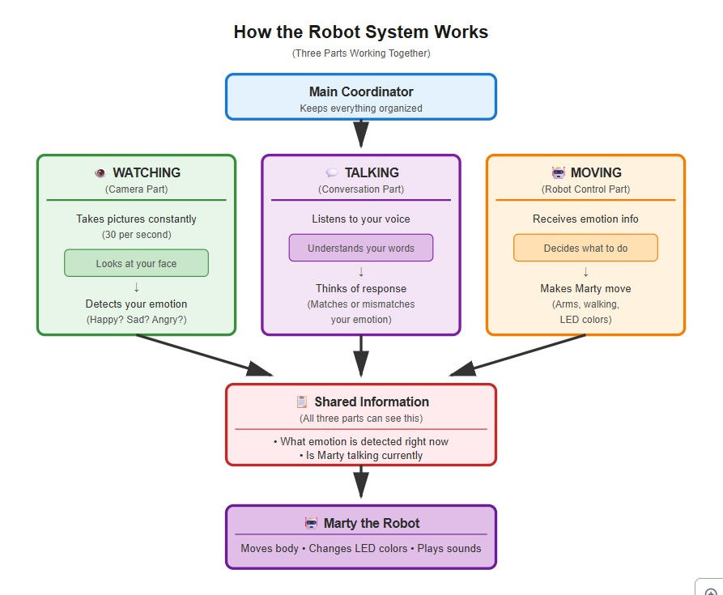

# RoboMarty - Emotion-Aware Social Robot 🤖

An interactive social robot system that combines real-time emotion detection, object recognition, and natural conversation using the Marty robot platform.



## Features

- **Real-time Emotion Detection**: Uses DeepFace to detect user emotions (happy, sad, angry, neutral)
- **Object Recognition**: YOLOv8-based detection for favorite objects (ball)
- **Emotional Responses**: Marty reacts with appropriate movements, colors, and behaviors based on detected emotions
- **Natural Conversation**: Voice-based interaction using:
  - OpenAI Whisper for speech-to-text
  - GPT-4o-mini for conversational AI
  - ElevenLabs for expressive text-to-speech
- **Two Interaction Modes**:
  - **Matched Mode**: Responds with matching emotional tone
  - **Mismatch Mode**: Experimental mode with intentionally mismatched emotional responses
- **Multi-threaded Architecture**: Concurrent processing of camera input, emotion responses, and conversation

## System Architecture

The system runs three independent threads:
1. **Camera Thread**: Processes video frames for emotion and object detection (~30 FPS)
2. **Emotion Processor Thread**: Handles emotion-based movements and LED colors
3. **Conversation Thread**: Manages voice interaction and AI responses

## Hardware Requirements

- Marty the Robot (connected via USB)
- Webcam
- Microphone
- Speaker/audio output

## Software Requirements

See `requirements.txt` for a complete list. Key dependencies:
- Python 3.8+
- martypy
- OpenCV
- DeepFace
- YOLOv8 (ultralytics)
- OpenAI API
- ElevenLabs API
- SpeechRecognition

## Installation

1. **Clone the repository**
```bash
git clone https://github.com/yourusername/robomarty.git
cd robomarty
```

2. **Install dependencies**
```bash
pip install -r requirements.txt
```

3. **Download YOLOv8 model**
```bash
# The yolov8n.pt model will be downloaded automatically on first run
# Or download manually from: https://github.com/ultralytics/ultralytics
```

4. **Set up API keys**

Create a `.env` file in the project root:
```env
OPENAI_API_KEY=your_openai_api_key_here
ELEVENLABS_API_KEY=your_elevenlabs_api_key_here
```

5. **Configure Marty USB port**

Update the COM port in `main.py` (line 23) to match your system:
```python
my_marty = martypy.Marty("usb", "COM6")  # Windows
# Or for Linux/Mac:
# my_marty = martypy.Marty("usb", "/dev/ttyUSB0")
```

## Usage

### Basic Operation

Run the main program:
```bash
python main.py
```

The system will:
- Connect to Marty
- Start camera processing
- Begin listening for conversations
- Respond to emotions and detected objects

Press `Ctrl+C` to stop.

### Switching Modes

To toggle between Matched and Mismatch conversation modes, modify the `Match` variable in `main.py` (line 17):
```python
Match = True   # Matched emotion mode
Match = False  # Mismatch emotion mode (experimental)
```

### Testing Individual Modules

**Test camera module only:**
```bash
python Camera_Module.py
```

**Test conversation module:**
```bash
python Matched_Conversation_Module.py
# or
python Mismatch_Conversation_Module.py
```

## Project Structure

```
robomarty/
│
├── main.py                          # Main orchestration script
├── Camera_Module.py                 # Emotion & object detection
├── Matched_Conversation_Module.py   # Standard conversation AI
├── Mismatch_Conversation_Module.py  # Experimental mismatch mode
├── requirements.txt                 # Python dependencies
├── .env                            # API keys (not committed)
├── .gitignore                      # Git ignore file
│
├── yolov8n.pt                      # YOLO model (auto-downloaded)
├── BALL_LOVE.mp3                   # Audio file for ball detection
└── mismatch.mp3                    # Audio file for mismatch mode
```

## Emotion-Based Behaviors

| Emotion | LED Color | Movement | Voice Settings |
|---------|-----------|----------|----------------|
| Happy   | Yellow    | Walking with arm waves, dancing | Fast, excited (rate: 1.2) |
| Sad     | Blue      | Leaning forward, slow walk | Slow, soft (rate: 0.7) |
| Angry   | Red       | Rapid arm movements | Fast, firm (rate: 1.3) |
| Neutral | White     | Ready position | Normal (rate: 1.0) |

## Troubleshooting

**Camera not working:**
- Check camera index in `Camera_Module.py` (line 6): `cam = cv2.VideoCapture(0)`
- Try different indices (0, 1, 2) if multiple cameras are connected

**Marty not connecting:**
- Verify USB cable connection
- Check COM port/device path
- Ensure martypy drivers are installed

**Audio not recording:**
- Check microphone permissions
- Test with: `python -m speech_recognition`

**API errors:**
- Verify API keys in `.env` file
- Check API quota limits
- Ensure internet connection

## API Keys Setup

### OpenAI API
1. Sign up at [OpenAI Platform](https://platform.openai.com/)
2. Generate API key from dashboard
3. Add to `.env` file

### ElevenLabs API
1. Sign up at [ElevenLabs](https://elevenlabs.io/)
2. Get API key from profile settings
3. Add to `.env` file

## Contributing

Contributions are welcome! Please:
1. Fork the repository
2. Create a feature branch (`git checkout -b feature/AmazingFeature`)
3. Commit your changes (`git commit -m 'Add some AmazingFeature'`)
4. Push to the branch (`git push origin feature/AmazingFeature`)
5. Open a Pull Request

## License

This project is licensed under the MIT License - see the LICENSE file for details.

## Acknowledgments

- [Marty the Robot](https://www.robotical.io/) - Robot platform
- [DeepFace](https://github.com/serengil/deepface) - Emotion detection
- [YOLOv8](https://github.com/ultralytics/ultralytics) - Object detection
- [OpenAI](https://openai.com/) - Conversational AI
- [ElevenLabs](https://elevenlabs.io/) - Voice synthesis

## Research Context

This project was developed for human-robot interaction research exploring:
- Emotional congruence in robot responses
- Impact of emotion matching vs. mismatching on user experience
- Multi-modal social robot interactions

## Contact

For questions or collaboration opportunities, please open an issue on GitHub.

---

**Note**: Remember to add your audio files (`BALL_LOVE.mp3`, `mismatch.mp3`) to the repository or document how to obtain them.